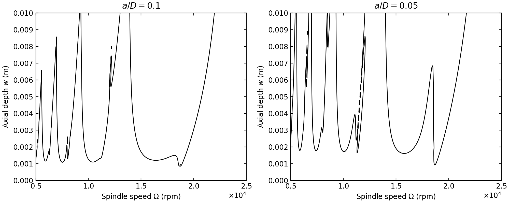

# MillStability

基于 PyTorch、C++ 和 CUDA 的铣削稳定性计算库。支持扫描主轴转速与轴向切深网格，以及在固定工艺点计算多组物理参数的稳定性。

每个工艺点构造一个状态转移矩阵 `F`，返回其特征值最大模：

```text
EI = max(abs(eigenvalues(F)))
```

`EI < 1` 表示稳定，`EI > 1` 表示不稳定，`EI = 1` 是稳定性边界。输出为 CUDA `float32` 张量，接近边界时需要考虑浮点误差和离散精度。

## 安装

需要 NVIDIA GPU、可用的 NVIDIA 驱动、Python 3.10+、支持 C++17 的编译器，以及 CUDA Toolkit 12.8+。Toolkit 必须包含 `nvcc`、cuBLAS 和 cuSOLVER；仅安装 PyTorch 的 CUDA 运行库不足以编译扩展。

已验证的组合为 Linux、Python 3.10、PyTorch 2.8.0（CUDA 12.8）、CUDA Toolkit 12.8 和 RTX 3090。以下命令使用该 PyTorch/CUDA 组合，其他组合需要自行验证。

```bash
git clone https://github.com/kiwmn/millstability.git
cd millstability

python3 -m venv .venv
source .venv/bin/activate
python -m pip install --upgrade pip setuptools wheel ninja
python -m pip install torch==2.8.0 --index-url https://download.pytorch.org/whl/cu128

export CUDA_HOME=/usr/local/cuda-12.8
MAX_JOBS=4 python -m pip install --no-build-isolation ".[examples]"
python examples/basic_usage.py
```

将 `CUDA_HOME` 改为实际 Toolkit 目录。编译时默认检测可见 GPU；可用 `TORCH_CUDA_ARCH_LIST` 指定目标架构，例如 RTX 3090 使用 `8.6`。`MAX_JOBS` 控制并行编译进程数，内存不足时可降低。

`--no-build-isolation` 使用当前环境中的 PyTorch 编译扩展。更换 PyTorch 或 CUDA 环境后应重新编译安装。PyTorch 安装版本见[官方说明](https://pytorch.org/get-started/previous-versions/#v280)。

## 使用

先导入 `torch`，再导入 `millstability`。安装时的 `[examples]` 包含绘图所需的 Matplotlib；仅使用计算接口可安装 `.`。

### 论文中的两个 2DOF 案例

[examples/basic_usage.py](examples/basic_usage.py) 绘制 2010 年论文表 2 的两个逆铣案例：`a/D=0.1` 和 `0.05`，`m=40`，转速与切深分别划分为 400、200 个区间。程序计算 `EI=1` 等值线，保存为 `examples/two_dof_stability.png`，并打印每个案例的计算耗时。

每个案例包含 80,601 个工艺点。单张 RTX 3090、Intel Xeon Platinum 8373C、PyTorch 2.8.0+cu128 下，按示例顺序各运行一次的实测结果：

| 案例 | 计算耗时（秒） |
| --- | ---: |
| `a/D=0.1` | 177.70 |
| `a/D=0.05` | 167.96 |

计时在调用前后同步 CUDA，包含矩阵构造、特征值求解和 EI 计算，不包含绘图与图片保存。



### 转速与切深网格

```python
import math
import torch
import millstability

ei = millstability.milling_stability_ei_cuda(
    N=2, Kt=6.0e8, Kn=2.0e8,
    w0x=922.0 * 2 * math.pi, w0y=922.0 * 2 * math.pi,
    zetax=0.011, zetay=0.011, m_tx=0.03993, m_ty=0.03993,
    aD=0.05, up_or_down=1,
    stx=4, sty=3,
    w_st=0.0, w_fi=0.01, o_st=5000.0, o_fi=25000.0,
    m=40, device_id=0,
)
print(ei.shape)       # torch.Size([5, 4])
unstable = ei > 1.0
```

输出形状为 `(stx + 1, sty + 1)`，两个端点均包含在网格内。`ei[x, y]` 对应：

```text
主轴转速 = o_st + x * (o_fi - o_st) / stx
轴向切深 = w_st + y * (w_fi - w_st) / sty
```

| 参数 | 含义和单位 | 要求 |
| --- | --- | --- |
| `N` | 刀齿数 | 正整数 |
| `Kt`, `Kn` | 切向、法向切削力系数，N/m² | 有限数值 |
| `w0x`, `w0y` | x、y 方向固有角频率，rad/s | 正数；Hz 乘以 `2π` 转换 |
| `zetax`, `zetay` | x、y 方向阻尼比，无量纲 | 有限数值 |
| `m_tx`, `m_ty` | x、y 方向模态质量，kg | 正数 |
| `aD` | 径向切宽与刀具直径之比 | `[0, 1]` |
| `up_or_down` | 铣削方向 | `1` 为逆铣，`-1` 为顺铣 |
| `stx`, `sty` | 转速、切深区间的划分数 | 正整数；`sty + 1` 不超过 GPU 每块最大线程数 |
| `w_st`, `w_fi` | 轴向切深起止值，m | 非负有限数值 |
| `o_st`, `o_fi` | 主轴转速起止值，rpm | 正有限数值 |
| `m` | 一个刀齿通过周期内的时间离散步数 | 整数，`1 <= m <= 40` |
| `device_id` | CUDA 设备编号 | 默认 `0` |

### 固定工艺点，多组物理参数

```python
parameters = torch.tensor([
    [6.0e8, 2.0e8, 922.0 * 2 * math.pi, 922.0 * 2 * math.pi,
     0.011, 0.011, 0.03993, 0.03993],
], dtype=torch.float32, device="cuda:0")

ei = millstability.multi_parameter_single_point_ei(
    parameters, N=2, aD=0.05, up_or_down=1, m=40,
    w=0.004, o=15000.0, device_id=0,
)
print(ei.shape)       # torch.Size([1])
```

`parameters` 必须是连续的 CUDA `float32` 张量，形状为 `(n_params, 8)`，八列顺序为 `Kt, Kn, w0x, w0y, zetax, zetay, m_tx, m_ty`。张量所在设备必须与 `device_id` 一致；必要时使用 `.to(device="cuda:0", dtype=torch.float32).contiguous()` 转换。

`w` 为轴向切深（m），`o` 为主轴转速（rpm），其余参数与网格接口相同。输出形状为 `(n_params,)`，与输入行顺序一致；空输入返回空张量。单个工艺点、单组参数可使用一行输入。

### 固定参数网格

`millstability.test_ei(device_id=0)` 使用上面的示例物理参数，固定 `m=40`，在 5,000–25,000 rpm、0–0.01 m 范围返回 `(201, 101)` 网格。它会计算 20,301 个点，适合需要该固定网格时使用。

## 实现与限制

- 计算采用 `float32` 和 CUDA fast math；矩阵指数使用最高十阶 Taylor 展开。离散步数和输入参数会影响精度，不能仅凭接近 `1` 的 EI 判断稳定性。
- 仅支持 CUDA 前向计算，不提供 CPU 后备实现和自动求导。
- 矩阵构造及 EI 归约在 GPU 上执行，特征值由 [cuSOLVER Xgeev](https://docs.nvidia.com/cuda/archive/12.8.2/cusolver/index.html#cusolverdnxgeev) 求解。该求解器使用 CPU/GPU 协同计算和主机工作区，接口也包含同步错误检查。
- 每点的内部矩阵阶数为 `2*m + 4`，矩阵存储约需 `点数 × (2*m + 4)² × 4` 字节。固定网格仅矩阵就约需 546 MiB，另需中间数据和求解器工作区。大网格或参数批次应按显存容量拆分调用。
- 非法形状、类型、设备、非有限输入或求解失败会抛出异常。核函数采用 32 位矩阵索引，过大的批次会被拒绝。

## 目录

`src/` 包含 Python 绑定、矩阵构造和 EI 求解；`include/millstability/` 包含头文件；`examples/basic_usage.py` 绘制论文的两个 2DOF 案例。根目录的 `setup.py`、`pyproject.toml` 和 `MANIFEST.in` 分别负责 CUDA 编译、构建依赖和源码打包。

## 参考文献

Ding, Y., Zhu, L. M., Zhang, X. J., & Ding, H. (2010). A full-discretization method for prediction of milling stability. *International Journal of Machine Tools and Manufacture*, **50**(5), 502–509. [DOI: 10.1016/j.ijmachtools.2010.01.003](https://doi.org/10.1016/j.ijmachtools.2010.01.003).

## 许可证

[MIT](LICENSE)
